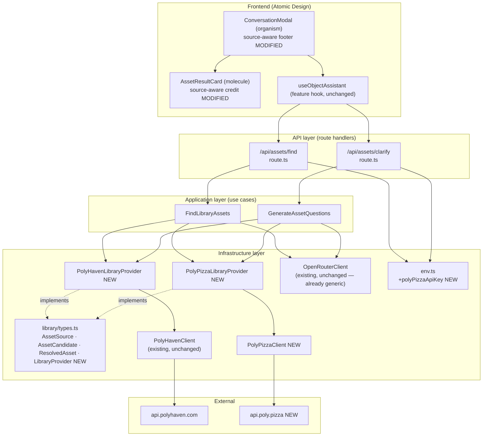

# HLD — Multi-source model library: Poly Pizza + Poly Haven

- Run: `20260810-192054-polypizza-source`
- Spec: `01-specification.md`
- Classification: `Feature`

## 1. Current Architecture (observed)
| Aspect | Finding | Evidence (file) |
|---|---|---|
| Stack & versions | Next.js 16.3.0, React 19.2.8, TypeScript 5, Vitest 4.1.10, `@vitejs/plugin-react` for RTL tests | `package.json` |
| Directory conventions | Clean Architecture backend (`src/domain`, `src/application`, `src/infrastructure`, `src/app/api`); Atomic Design frontend (`src/components/{atoms,molecules,organisms,templates,features,shared}`) | `README.md:11-13`, `src/**` |
| Data access pattern | SQLite via `better-sqlite3`, used only for generation-job history — the asset-search flow is stateless/transient, no persistence | `src/infrastructure/db/sqlite/client.ts` |
| External API client pattern | One class per provider under `src/infrastructure/<provider>/`, `getJson<T>` helper with `AbortController` timeout (15s), module-level in-memory cache where the upstream is cacheable | `src/infrastructure/polyhaven/PolyHavenClient.ts:49-211` |
| Composition root pattern | Route handlers (`src/app/api/**/route.ts`) `new` their infrastructure clients directly and pass them into a use case constructor — no DI container | `src/app/api/assets/find/route.ts:78`, `src/app/api/assets/clarify/route.ts:46` |
| Validation pattern | Small pure `validate*` functions returning a discriminated result, called at the top of a use case's `execute()` | `src/application/objects/validation/objectDescriptionValidation.ts` (used by `FindLibraryAssets.execute`) |
| Config pattern | `src/infrastructure/config/env.ts` — single memoized `getServerConfig()`, one field per env var, explicit "server-only, never import from `use client`" doc comment; `OPENROUTER_API_KEY` is the one precedent read directly via `process.env` in a route handler instead of through `env.ts` | `src/infrastructure/config/env.ts`, `src/app/api/assets/find/route.ts:36` |
| Test framework | Vitest + `jsdom`, colocated `__tests__/` folders next to the unit under test, `vi.useFakeTimers()` for time-dependent logic | `vitest.config.ts`, `src/infrastructure/ratelimit/__tests__/RateLimiter.test.ts` |

## 2. Problem Statement
The model finder currently searches one asset source (Poly Haven, ~500 models). The user
needs a second, live-search source (Poly Pizza) merged into the same AI-ranked results, so
the finder can match a wider range of descriptions — without breaking Poly Haven's existing
behaviour when Poly Pizza is unavailable or its key is not configured.

## 3. Proposed Approach
Introduce a `LibraryProvider` seam (`source`, `findCandidates`, `resolveAsset`) in a new
shared module, `src/infrastructure/library/types.ts`, that both Poly Haven and Poly Pizza
implement. `AssetCandidate`/`ResolvedAsset` move there too, gaining a `source` field
(`'polyhaven' | 'polypizza'`) and, on `ResolvedAsset`, optional `licence`/`attribution`
fields. `polyhaven/types.ts` keeps re-exporting the same two types by identity, so the 8
files that already import them compile unchanged — this is additive, not a rename.

Two new adapters wrap the existing `PolyHavenClient` and a new, minimal `PolyPizzaClient`:
`PolyHavenLibraryProvider` (prefixes candidate ids `polyhaven:<slug>`; `resolveAsset` builds
the `ResolvedAsset` exactly as `FindLibraryAssets` does today — same `/api/assets/{id}/gltf`
URL, same dimension math) and `PolyPizzaLibraryProvider` (prefixes ids `polypizza:<ID>`;
caches each search response by raw id on the instance so `resolveAsset` needs no second
network call — Poly Pizza's `Download` URL becomes `gltfUrl` verbatim, since it is already a
CORS-open, directly loadable `.glb`).

`FindLibraryAssets` and `GenerateAssetQuestions` change from "one `PolyHavenClient`" to
"an array of `LibraryProvider`s", fanning candidate search out with `Promise.allSettled` so
one provider's failure never blocks the other's results (FR-9/FR-10). The two route
composition roots build that array, appending `PolyPizzaLibraryProvider` only when
`POLY_PIZZA_API_KEY` is set (FR-2). The ranker (`OpenRouterClient.rankAssets`) is untouched —
it already operates on a generic `AssetCandidate[]` and validates ranked ids against
whatever candidate set it was given, so a merged, multi-source list is a drop-in.

`AssetResultCard` and `ConversationModal` gain a source-aware credit line: Poly Haven assets
keep their existing "CC0 · by …" text; Poly Pizza assets show their own `licence`, since Poly
Pizza mixes CC0 and CC-BY (FR-8/NFR-4).

## 4. Alternatives Considered
| Option | Pros | Cons | Verdict |
|---|---|---|---|
| Bolt Poly Pizza directly into `FindLibraryAssets` (no provider interface) | Fewer new files | Hard-codes a second provider-specific branch into the use case; breaks NFR-5 (adding a third source later means editing the use case again) | Rejected |
| Give `ResolvedAsset` a discriminated union per source instead of one shape with optional fields | Type-safe exhaustiveness on `source` | Forces all 8 existing consumers (`AssetResultCard`, `useObjectAssistant`, DTOs) to add narrowing they don't need yet; violates "smallest correct change" | Rejected |
| Have `PolyPizzaLibraryProvider.resolveAsset` re-query Poly Pizza by id instead of caching search results | Simpler provider, no instance-scoped cache | No confirmed get-by-id endpoint exists (see spec); would need to search again by a term derived from the id, which is unreliable | Rejected — violates FR-6 |
| Read `POLY_PIZZA_API_KEY` through `getServerConfig()` like every other var | Consistent with `env.ts`'s documented pattern | — | **Accepted**, matching NFR-2 and the existing pattern more closely than the `OPENROUTER_API_KEY` precedent |

## 5. Component View


## 6. Key Sequence
```mermaid
sequenceDiagram
  participant UI as ConversationModal
  participant Route as POST /api/assets/find
  participant FLA as FindLibraryAssets
  participant PHP as PolyHavenLibraryProvider
  participant PPP as PolyPizzaLibraryProvider
  participant AI as OpenRouterClient

  UI->>Route: description, questions, answers
  Route->>Route: build providers[] (PolyHaven always;\nPolyPizza only if POLY_PIZZA_API_KEY set)
  Route->>FLA: execute(description, questions, answers)
  par fan-out (Promise.allSettled)
    FLA->>PHP: findCandidates(description, 15)
    PHP-->>FLA: AssetCandidate[] (id: "polyhaven:...")
  and
    FLA->>PPP: findCandidates(description, 15)
    alt Poly Pizza reachable
      PPP-->>FLA: AssetCandidate[] (id: "polypizza:...")
    else Poly Pizza fails/times out
      PPP-->>FLA: rejected (logged, non-fatal)
    end
  end
  FLA->>FLA: merge fulfilled candidate lists
  alt both providers failed
    FLA-->>Route: throw aggregated error
    Route-->>UI: 502 LIBRARY_ERROR
  else at least one succeeded
    FLA->>AI: rankAssets(description, merged candidates, questions, answers)
    AI-->>FLA: ranked ids + reason
    loop each ranked id
      FLA->>FLA: route by id prefix to owning provider
      FLA->>PHP: resolveAsset(id)  %% or PPP, whichever owns the prefix
      PHP-->>FLA: ResolvedAsset
    end
    FLA-->>Route: { assets, reason }
    Route-->>UI: 200 { assets, reason }
  end
```

## 7. Cross-Cutting Concerns
- **Security & authorization:** `POLY_PIZZA_API_KEY` is read only inside
  `src/infrastructure/config/env.ts` (server-only module, already documented as never
  importable from `"use client"`) and `PolyPizzaClient`, both server-side; the key never
  crosses into a `ResolvedAsset`/DTO field sent to the browser. No auth model change.
- **Performance & caching:** Poly Pizza has no cacheable index (it's a live search), so no
  module-level cache is added for it — each `findCandidates` call is a fresh request, capped
  by the same 15s timeout pattern as Poly Haven. Poly Haven's existing 1h index cache is
  untouched.
- **Error handling & observability:** provider failures are caught individually
  (`Promise.allSettled`) and `console.error`-logged with the provider's `source` tag; the
  route's existing error-message-substring mapping (`errorMessage.includes('Poly Haven')`)
  is broadened to also match a Poly-Pizza-specific and an aggregated-failure message, so the
  existing 502 `LIBRARY_ERROR` contract still fires when every provider fails.
- **Accessibility / i18n:** licence/attribution text added to `AssetResultCard` is plain
  visible text (not a tooltip-only affordance), satisfying NFR-4; no new interactive
  controls are added, so no new focus/ARIA surface.
- **Backward compatibility:** `polyhaven/types.ts` re-exports the shared types by identity;
  `ResolvedAsset`'s new fields (`source`, `licence?`, `attribution?`) are additive and
  optional; existing Poly-Haven-only tests and behaviour are unaffected when
  `POLY_PIZZA_API_KEY` is unset (FR-12).

## 8. Impact & Blast Radius
| Area | Impact | Risk |
|---|---|---|
| `src/infrastructure/polyhaven/types.ts` | Type re-export only, no behavioural change | Low |
| `src/application/objects/use-cases/FindLibraryAssets.ts` | Constructor signature changes (`PolyHavenClient` → `LibraryProvider[]`); both call sites (route + any future caller) must be updated | Medium |
| `src/application/objects/use-cases/GenerateAssetQuestions.ts` | Same constructor-signature change | Medium |
| `src/app/api/assets/find/route.ts`, `.../clarify/route.ts` | Composition root changes; error-mapping substring check widened | Low |
| `src/components/molecules/AssetResultCard.tsx`, `.../organisms/ConversationModal.tsx` | Presentational change only, no prop-shape break (new fields optional) | Low |
| `src/infrastructure/polyhaven/PolyHavenClient.ts`, `.../[id]/gltf/route.ts` | **Unchanged** — Poly Haven's gltf URL still uses the bare, unprefixed slug internally | None |

## 9. Open Design Decisions Requiring Human Approval
None. No new runtime dependency is introduced (Poly Pizza is called with the platform
`fetch`, exactly like `PolyHavenClient`); the only new environment variable
(`POLY_PIZZA_API_KEY`) is optional and degrades gracefully when absent, per FR-2.
