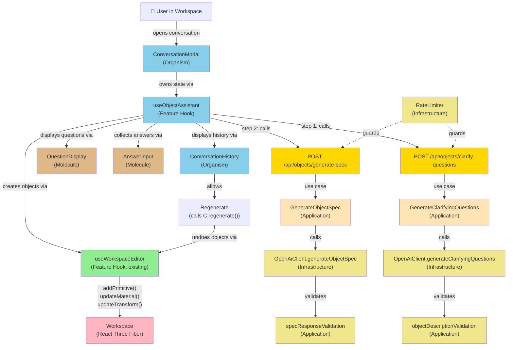
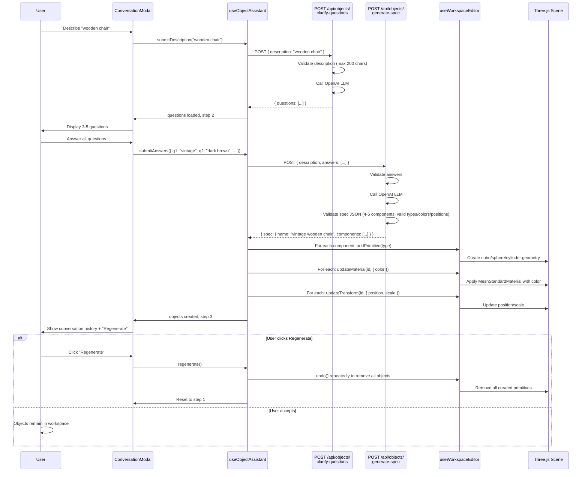

# HLD — Interactive AI Object Generation with Clarification

Run: `fape-001` | Spec: `01-specification.md` | Classification: `Feature`

---

## 1. Current Architecture (Observed)

| Aspect | Finding | Evidence |
|---|---|---|
| **Stack & Versions** | Next.js 16.3.0, React 19.2.8, React Three Fiber 9.7.0, TypeScript 5, Vitest 4.1.10, Tailwind CSS 4 | `hackathon/package.json`: lines 6, 16, 18–21, 35, 37–39 |
| **Backend Framework** | Next.js App Router with Clean Architecture layering | Directory structure: `src/domain/`, `src/application/`, `src/infrastructure/`, `src/app/api/` |
| **Frontend Architecture** | Atomic Design: atoms → molecules → organisms → features → shared | `src/components/{atoms,molecules,organisms,features,shared,templates}` |
| **Data Access Pattern** | Repository pattern (e.g., `GenerationJobSqliteRepository`), hand-rolled SQL migrations | `src/infrastructure/db/GenerationJobSqliteRepository.ts`, `src/infrastructure/db/sqlite/migrate.ts`, `src/infrastructure/db/migrations/*.sql` |
| **Validation Pattern** | Custom validation classes (e.g., `ValidationError`) in application layer; no external validation library | `src/application/generation-job/validation/errors.ts`, `src/application/generation-job/validation/generationSettingsValidation.ts` |
| **Auth Pattern** | None currently (public endpoints); spec does not require auth | No JWT/session logic in codebase |
| **State Management** | Custom React hooks with `useCallback`, `useRef`, `useState`; no Redux/Context | `src/components/features/{workspace,upload,settings}/*.ts` (e.g., `useWorkspaceEditor.ts`, `useWorkspaceObjects.ts`) |
| **API Communication** | Centralized `httpClient.request()` function (single fetch wrapper) | `src/components/shared/api/httpClient.ts` |
| **3D Rendering** | React Three Fiber 9.7.0 + Three.js; GLB viewer existing | `src/components/organisms/GlbViewer.tsx`, workspace import/export logic |
| **Database** | SQLite + better-sqlite3; no ORM | `src/infrastructure/db/sqlite/client.ts`, migration system at `src/infrastructure/db/sqlite/migrate.ts` |
| **External APIs** | Gradio client for TRELLIS.2 image-to-3D; no OpenAI integration yet | `src/infrastructure/ai/trellis/TrellisGradioClient.ts`, `package.json`: `@gradio/client ^2.4.0` |
| **Test Framework** | Vitest + React Testing Library + jsdom | `package.json`, existing test patterns in `__tests__/` folders colocated with source |
| **Error Handling** | Domain errors + API error responses with `{ code, message, details? }` shape | `src/domain/generation-job/DomainError.ts`, HTTP client throws `ApiError` |

---

## 2. Problem Statement

Users currently can only generate 3D objects from images (via TRELLIS.2) or manually add basic primitives to the workspace. The feature requires enabling users to describe objects in natural language and have an AI assistant ask clarifying questions interactively, then generate 3D scenes with multiple primitives composed to match the description. This requires:

1. A multi-turn conversation flow (description → questions → answers → object spec)
2. Integration with OpenAI LLM for question generation and spec generation
3. Conversion of AI-generated specifications into workspace objects (primitives + materials)
4. Undo/redo support for the generated objects
5. Rate limiting and error handling for AI API calls

---

## 3. Proposed Approach

### High-Level Flow

```
Frontend (User)
    ↓
User describes object (FR-1)
    ↓
[ConversationModal orchestrates entire flow via useObjectAssistant hook]
    ↓
POST /api/objects/clarify-questions
    ↓
Backend: OpenAiClient.generateClarifyingQuestions()
    ↓
Questions returned (AC-1: 3–5 questions)
    ↓
User answers questions (FR-3)
    ↓
POST /api/objects/generate-spec
    ↓
Backend: OpenAiClient.generateObjectSpec()
    ↓
Spec returned: { name, components: [{ type, color, position, size }] }
    ↓
Frontend: createObjectsFromSpec() calls useWorkspaceEditor.addPrimitive() + updateMaterial() + updateTransform()
    ↓
Objects appear in workspace (AC-3)
    ↓
User can view conversation history (AC-4)
    ↓
User can regenerate with different answers (AC-5) → undo all objects, restart
```

### Component Hierarchy

```
ConversationModal (Organism, manages all state)
├── Step 1: Description Input
│   └── ObjectDescriptionInput (Molecule)
├── Step 2: Questions & Answers
│   ├── QuestionDisplay (Molecule)
│   └── AnswerInput (Molecule, multiple instances)
├── Step 3: Conversation History & Results
│   └── ConversationHistory (Organism)
└── All steps integrate via useObjectAssistant (Feature Hook)
```

### Layer Allocation

**Backend (Clean Architecture):**
- **Domain**: (None new — object generation is stateless, session-scoped)
- **Application**: Use cases (GenerateClarifyingQuestions, GenerateObjectSpec), DTOs, validation, error types
- **Infrastructure**: OpenAI client, rate limiter, prompt design
- **API**: Routes (`POST /api/objects/clarify-questions`, `POST /api/objects/generate-spec`)

**Frontend (Atomic Design):**
- **Atoms**: Native HTML + Tailwind (inherited from existing atoms: Button, Input, etc.)
- **Molecules**: ObjectDescriptionInput, QuestionDisplay, AnswerInput (new)
- **Organisms**: ConversationModal, ConversationHistory (new)
- **Features**: useObjectAssistant hook, workspace integration (new)
- **Shared**: Existing httpClient for API communication

### Key Integration Points

1. **useWorkspaceEditor** (existing hook): Called by useObjectAssistant to add primitives, set materials, positions
2. **httpClient.request()** (existing): Used by useObjectAssistant to call new API routes
3. **Undo/redo**: Snapshot recording happens at start of object creation; all created objects rolled back in one undo

---

## 4. Alternatives Considered

| Option | Pros | Cons | Verdict |
|---|---|---|---|
| **Single streaming endpoint** (Server-Sent Events for questions + spec) | One round-trip instead of two | Added complexity; spec: two sequential calls with pauses; no latency benefit | **Rejected**: Unnecessary; spec design is simpler with separate endpoints |
| **Persist conversation to SQLite** | Conversation audit trail, analytics | Spec explicitly requires session-only; adds DB schema + migration; user value unclear | **Rejected**: Spec § ASSUMPTIONS excludes this |
| **Use Vercel AI SDK (ai/react)** | Built-in streaming, hooks | New dependency not in codebase; spec doesn't require streaming | **Rejected**: Adds complexity without value |
| **Tangram3D or similar 3D-specific generation API** | Purpose-built for 3D | Less flexible than LLM for custom descriptions; cost/latency tradeoffs | **Rejected**: OpenAI LLM chosen for flexibility |
| **Client-side OpenAI calls (expose API key)** | Simpler implementation | **SECURITY RISK**: API key exposure; violates spec § NFR-4 | **Rejected**: All AI calls must be server-side |
| **Use React Hook Form + Zod for answer input** | Comprehensive validation | Simple text/choice input doesn't justify heavy framework; inline validation sufficient | **Rejected**: Over-engineering; CLAUDE.md pattern for form validation not needed here |

---

## 5. Component View



---

## 6. Key Sequence Diagram

### Scenario: Happy Path (AC-1 → AC-2 → AC-3)



---

## 7. Cross-Cutting Concerns

### Security & Authorization
- **API Key Protection**: `OPENAI_API_KEY` never exposed to client; all OpenAI calls server-side only (route handlers)
- **Input Sanitization**: Description validated for length and type; answers validated against question schema
- **Rate Limiting**: 10 objects/user/hour tracked by IP + session identifier (NFR-2); returns 429 if exceeded
- **No Auth Required**: Feature is public (workspace is local, no multi-user); no JWT/session checks needed

### Performance & Caching
- **API Latency**: Design targets < 3 seconds per call (OpenAI typical: 1–2 seconds)
- **Timeout**: All OpenAI calls timeout at 30 seconds; user can retry
- **Retry Logic**: Exponential backoff (100ms, 200ms, 400ms) for transient errors; max 3 retries
- **No Caching**: Conversation is session-only; new requests generate fresh spec (users may want variation)
- **Component Limits**: Max 6 components per object prevents scene overload (NFR-1)

### Error Handling & Observability
- **Error Types**: ObjectValidationError, ObjectGenerationError, RateLimitError (extend domain error base)
- **User-Facing Messages**: Friendly, actionable (e.g., "Description too long. Max 200 characters.")
- **Server Logging**: Log all OpenAI API calls, errors, and rate-limit events for debugging
- **Retry Signaling**: Return HTTP status codes and Retry-After header for rate limits

### Accessibility / i18n
- **WCAG Compliance**: All new components use semantic HTML, ARIA labels (inherited from existing atoms)
- **No i18n Required**: Spec design does not require multi-language support; prompts sent to OpenAI in English only

### Backward Compatibility
- **Workspace**: No changes to existing workspace state model; generated objects use same WorkspaceObject type
- **API**: No changes to existing routes (e.g., `/api/generate`, `/api/jobs`)
- **Database**: No schema changes; session-only state (no persistence)
- **Undo/Redo**: New objects participate in existing history system via useWorkspaceEditor snapshot mechanism

---

## 8. Impact & Blast Radius

| Area | Impact | Risk | Mitigation |
|---|---|---|---|
| **Workspace** | Objects created via AI are stored in workspace state; undo/redo includes them | Low: uses existing hooks (addPrimitive, updateMaterial) | Comprehensive end-to-end tests (T-19) verify undo behavior |
| **Frontend Bundle** | Add ~3–5 new components (modal, inputs, history) + hook; ~500 LOC | Low: isolated feature | No lazy-loading needed (modal small); import via existing patterns |
| **Backend Routes** | Add 2 new routes (`/api/objects/clarify-questions`, `/api/objects/generate-spec`) | Low: new routes only, no modification to existing | Route tests (T-16) verify error cases and rate limiting |
| **Dependencies** | Add `openai ^4.0.0` npm package | Medium: external API dependency; cost risk if not rate-limited | Rate limiter (T-5) enforces 10/hour; cost $0.50/user/day max |
| **Database** | No changes | None | No migration needed |
| **Existing Code** | Zero modifications to existing files | None | Purely additive; existing code paths untouched |

---

## 9. Open Design Decisions Requiring Human Approval

**None.** All design decisions align with the existing codebase architecture and stated technology stack. OpenAI library is a new external dependency but is justified by spec requirements and has been called out explicitly.

---

## 10. Backend Module Boundaries

```
src/
├── app/api/objects/                          [NEW API Layer]
│   ├── clarify-questions/
│   │   ├── route.ts                          [Route handler]
│   │   └── __tests__/
│   │       └── route.test.ts                 [Route tests]
│   └── generate-spec/
│       ├── route.ts                          [Route handler]
│       └── __tests__/
│           └── route.test.ts                 [Route tests]
│
├── application/objects/                      [NEW Application Layer]
│   ├── use-cases/
│   │   ├── GenerateClarifyingQuestions.ts
│   │   ├── GenerateObjectSpec.ts
│   │   └── __tests__/
│   │       ├── GenerateClarifyingQuestions.test.ts
│   │       └── GenerateObjectSpec.test.ts
│   ├── dto/
│   │   ├── ClarifyQuestionsRequestDTO.ts
│   │   ├── ClarifyQuestionsResponseDTO.ts
│   │   ├── GenerateSpecRequestDTO.ts
│   │   └── GenerateSpecResponseDTO.ts
│   ├── validation/
│   │   ├── objectDescriptionValidation.ts
│   │   ├── specResponseValidation.ts
│   │   ├── errors.ts
│   │   └── __tests__/
│   │       ├── objectDescriptionValidation.test.ts
│   │       └── specResponseValidation.test.ts
│   └── ports/
│       └── OpenAiPort.ts                     [Interface for OpenAI abstraction]
│
├── infrastructure/ai/openai/                 [NEW Infrastructure Layer]
│   ├── OpenAiClient.ts                       [Implementation of OpenAiPort]
│   ├── prompts.ts                            [System prompts for LLM]
│   ├── __tests__/
│   │   └── OpenAiClient.test.ts
│   └── types.ts                              [OpenAI types]
│
└── infrastructure/ratelimit/                 [NEW Infrastructure Layer]
    ├── RateLimiter.ts
    ├── __tests__/
    │   └── RateLimiter.test.ts
    └── types.ts
```

**Dependency Direction** (enforced by TypeScript imports):
- Routes → Use Cases → Application interfaces/DTOs → Infrastructure (OpenAI, RateLimiter)
- Application never imports from Routes or UI
- Infrastructure never imports from Application (uses dependency injection)

---

## 11. Frontend Component Tree

```
src/components/
├── atoms/                      [Existing; reused]
│   ├── Button
│   ├── Input (TextInput)
│   └── ...
│
├── molecules/                  [New additions]
│   ├── ObjectDescriptionInput (T-9)
│   │   └── Uses: TextInput (atom), Button (atom)
│   ├── QuestionDisplay (T-10)
│   │   └── Uses: existing text rendering
│   └── AnswerInput (T-11)
│       └── Uses: TextInput or Select (atoms)
│
├── organisms/
│   ├── ConversationModal (T-12) [NEW]
│   │   ├── Uses: ObjectDescriptionInput, QuestionDisplay, AnswerInput, ConversationHistory
│   │   ├── Owns: Modal layout, step transitions
│   │   └── Integrates: useObjectAssistant hook
│   │
│   ├── ConversationHistory (T-13) [NEW]
│   │   └── Displays: Full conversation transcript + result
│   │
│   └── [Existing organisms unchanged: GlbViewer, UploadPanel, etc.]
│
└── features/objects/           [NEW Feature folder]
    ├── useObjectAssistant.ts (T-14)
    │   ├── Manages: Conversation state, API orchestration
    │   ├── Calls: T-15 (workspace integration)
    │   └── Owns: step transitions, error handling
    │
    ├── __tests__/
    │   └── useObjectAssistant.test.ts
    │
    └── [Workspace integration via useWorkspaceEditor — existing hook, no changes]
```

**Owning Hooks/Services by Component:**
- `ObjectDescriptionInput` ← owned by `ConversationModal` via `useObjectAssistant`
- `QuestionDisplay` ← owned by `ConversationModal` via `useObjectAssistant`
- `AnswerInput` ← owned by `ConversationModal` via `useObjectAssistant`
- `ConversationModal` ← owns `useObjectAssistant`
- `ConversationHistory` ← displays state from `useObjectAssistant` (read-only)

---

## 12. Data Flow (State Shape)

**Frontend State** (in `useObjectAssistant`):
```ts
type ConversationStep = 'idle' | 'asking' | 'answering' | 'generating' | 'done' | 'error';

interface ConversationState {
  step: ConversationStep;
  description: string;
  questions: Question[] | null;
  answers: Map<string, string>;      // questionId → answer text
  spec: ObjectSpec | null;            // Generated specification
  error: string | null;               // User-friendly error message
  createdObjectIds: string[];         // IDs of objects created in workspace
}
```

**API Request/Response Shapes:**
- Request: `{ description: string }`
- Response: `{ questions: Question[] }`
- Request: `{ description: string, answers: Array<{ questionId, answer }> }`
- Response: `{ spec: { name, components: ObjectComponent[] } }`

---

## Summary

This feature integrates an AI-powered conversational assistant into the existing workspace via:
1. Two new server-side API endpoints (guardrails: server-only, rate-limited)
2. One new custom hook (`useObjectAssistant`) managing conversation state
3. New UI components (modal, input fields, history display) using existing atomic patterns
4. Integration with existing `useWorkspaceEditor` to create primitives and apply materials
5. Zero changes to existing code; purely additive

The design respects all existing architectural patterns (Clean Architecture backend, Atomic Design frontend, centralized state management, undo/redo history system) and introduces no new external frameworks or breaking changes.
